# 🚀 SaveX - Pricing Comparison Platform

SaveX is a platform that allows users to compare the prices of products between different supermarkets. Users can create shopping lists, add products to them, and compare pricings between the different supermarkets to save money.

---
## 🎥 Video Overview

Watch a quick video summary of the SaveX platform, showcasing its features, user interface, and functionality:

[](https://www.youtube.com/watch?v=8gDtK1MdL5E&ab_channel=V%C3%ADctor)  
*Click the image above to watch the video on YouTube.*


---

## 📎 Credits

| Name                        | URJC Mail                          | LinkedIn                                                            | Github                                              |
| --------------------------- | ---------------------------------- | ------------------------------------------------------------------- | --------------------------------------------------- |
| Daniel Santos López         | d.santos.2022@alumnos.urjc.es      | [Daniel Santos](https://www.linkedin.com/in/danisntoss/)            | [danisntoss](https://github.com/danisntoss)         |
| Elena Tordesillas Fernández | e.tordesillas.2022@alumnos.urjc.es | [Elena Tordesillas](https://www.linkedin.com/in/elena-tordesillas/) | [elenxt4](https://github.com/elenxt4)               |
| Diego Sánchez Rincón        | d.sanchezr.2022@alumnos.urjc.es    | [Diego Sánchez](https://www.linkedin.com/in/cub1z/)                 | [CuB1z](https://github.com/CuB1z)                   |
| Victor Arroyo Madera        | v.arroyom.2021@alumnos.urjc.es     | [Victor Arroyo](https://www.linkedin.com/in/victorarroyomadera/)    | [victorrosalejo](https://github.com/victorrosalejo) |
| Jaime Portillo Pérez        | jj.portillo.2022@alumnos.urjc.es   | [Jaime Portillo](https://www.linkedin.com/in/porti/)                | [PortiESP](https://github.com/PortiESP)             |

---

## 🚀 Getting Started without Docker

To get started with SaveX, follow these steps:

### 🛠️ Prerequisites

| Technology  | Version | Description                                                   |
| ----------- | ------- | ------------------------------------------------------------- |
| Java        | 21      | Programming language used for backend development.            |
| Spring Boot | 3.4.3   | Framework for building Java-based enterprise applications.    |
| MySQL       | 8.0.33  | Relational database management system for data storage.       |
| Maven       | 3.8.3+  | Build automation tool used for managing project dependencies. |

### 🏗️ Installation and Set Up

1.  **Clone the repository**
```bash
git clone https://github.com/CodeURJC-DAW-2024-25/webapp01.git SaveX --branch main --depth 1
cd ./SaveX/backend
```

2. **Install MySQL**
Download and install MySQL from the official website: [MySQL Downloads](https://dev.mysql.com/downloads/).
Once installed, create a new database named `savexdb`.

3. **Set up the application properties**
Open the `src/main/resources/application.properties` file and configure the database connection settings by replacing the placeholders with your MySQL configuration:
```properties
spring.datasource.url=jdbc:mysql://localhost:3306/savexdb
spring.datasource.username=root
spring.datasource.password={{your_password}}
spring.datasource.driver-class-name=com.mysql.cj.jdbc.Driver

spring.jpa.hibernate.ddl-auto={{create-drop|update}}
spring.jpa.show-sql=true
spring.jpa.properties.hibernate.dialect=org.hibernate.dialect.MySQLDialect
```

4. **Build the project with Maven**
```bash
# Linux
./mvnw clean install

# Windows
.\mvnw.cmd clean install
```

5. **Run the application**
```bash
# Linux
./mvnw spring-boot:run

# Windows
.\mvnw.cmd spring-boot:run
```

**🌐 Access the application**
Open your web browser and navigate to `https://localhost:8443` to access the SaveX platform.

---

## 🐳 Getting Started with Docker

To get started with SaveX using Docker, follow these steps:

### 🛠️ Prerequisites

| Technology     | Version | Description                                                                 |
| -------------- | ------- | --------------------------------------------------------------------------- |
| Docker         | 20.10.8 | Containerization platform for building, shipping, and running applications. |
| Docker Compose | 1.29.2  | Tool for defining and running multi-container Docker applications.          |

### 🏗️ Installation and Set Up

1.  **Clone the repository**
```bash
git clone https://github.com/CodeURJC-DAW-2024-25/webapp01.git SaveX --branch main --depth 1
cd ./SaveX/docker
```

2. **Build the Docker image**
```bash
# Linux
chmod +x ./create_image.sh
./create_image.sh

# Windows
.\create_image.bat
```

3. **Run the Docker container**
```bash
docker compose up
```

**🌐 Access the application**
Open your web browser and navigate to `https://localhost:8443` to access the SaveX platform.

### 🚀 Deployment on ETSII Server

To deploy the application on the ETSII server, follow provided instructions in the section above and leave the application running on the server.

For access to the application, navigate to `appWeb01.dawgis.etsii.urjc.es` or `10.100.139.82` in your web browser or set up Postman to interact with the API.

By default, the application will have some users and posts preloaded for testing purposes.

> **Admin User**: 
> - Username: `admin`
> - Password: `admin`

> **Regular User**:
> - Username: `userDefault1`
> - Password: `pass1`

---

## 📚 API Documentation

The SaveX API provides endpoints for managing users, shopping lists, products, posts, and comments. The API documentation is available via Swagger UI, allowing users to explore and test the available endpoints.

In order to access the API documentation, follow these steps:

1. **Access the OpenAPI YAML file**
   Follow this link to access the OpenAPI YAML file: [OpenAPI Documentation](/api-docs/api-docs.yaml).

2. **View the API documentation in Swagger UI**
   Open the Swagger UI interface by navigating to `https://localhost:8443/swagger-ui.html` in your web browser or by using the following link: [Swagger UI](https://raw.githack.com/CodeURJC-DAW-2024-25/webapp01/main/backend/api-docs/api-docs.html).

---

## 📦 Entities

### 👤 User

| Field    | Type               |
| -------- | ------------------ |
| id       | Primary key        |
| email    | String (unique)    |
| username | String (unique)    |
| name     | String             |
| password | String (encrypted) |
| avatar   | Blob               |
| created  | Date               |

### 🛒 Supermarket

| Field | Type            |
| ----- | --------------- |
| id    | Primary key     |
| name  | String (unique) |

### 🛍️ Product (For caching data)

| Field        | Type                         |
| ------------ | ---------------------------- |
| id           | Primary key                  |
| name         | String                       |
| description  | String                       |
| price        | Float                        |
| supermarket  | Foreign key (Supermarket.id) |
| category     | String                       |
| image        | String                       |
| last_updated | Date                         |
| created      | Date                         |

### 📝 Shopping List

| Field   | Type                  |
| ------- | --------------------- |
| id      | Primary key           |
| name    | String                |
| user_id | Foreign key (User.id) |
| created | Date                  |

### 📝 Post

| Field       | Type                   |
| ----------- | ---------------------- |
| id          | Primary key            |
| title       | String                 |
| description | String                 |
| banner      | Blob                   |
| content     | String                 |
| created     | Date                   |
| modified    | Date                   |
| author      | String                 |
| visibility  | Enum (public, private) |

### 💬 Comment

| Field    | Type                  |
| -------- | --------------------- |
| id       | Primary key           |
| content  | String                |
| author   | Foreign key (User.id) |
| created  | Date                  |
| modified | Date                  |

---

## 📐 Database Schema Diagram

The following diagram illustrates the structure of our database, including tables, relationships, and key constraints:


This schema provides an overview of how different entities interact within the system. It helps in understanding the data flow and ensuring efficient database design.

---

## 🔒 User Permissions

| Permission                                | Anonymous User | Registered User | Admin User |
| ----------------------------------------- | -------------- | --------------- | ---------- |
| Can view homepage                         | ✅              | ✅               | ✅          |
| Can view products                         | ✅              | ✅               | ✅          |
| Can view product details                  | ✅              | ✅               | ✅          |
| Can search for products                   | ✅              | ✅               | ✅          |
| Can compare products                      | ✅              | ✅               | ✅          |
| Can view posts and comments               | ✅              | ✅               | ✅          |
| Can create / edit / delete own profile    | ❌              | ✅               | ❌          |
| Can create / edit / delete shopping lists | ❌              | ✅               | ✅          |
| Can create / edit / delete comments       | ❌              | ✅               | ✅          |
| Can manage other users' accounts          | ❌              | ❌               | ✅          |
| Can view user activity logs               | ❌              | ❌               | ✅          |
| Can create / edit / delete posts          | ❌              | ❌               | ✅          |

---

## 🖼️ Images

- Users will be able to upload images to set a profile picture.
- Products will have images provided by the supermarkets API.
- Posts will have a banner image.

---

## 📊 Graphics

- Admin dashboard will have some graphs to visualize users activity and supermarkets statistics

---

## 🛠️ Additional Technology

- **API**: We will use a supermarket API to get the products and their details (prices, descriptions, etc).

---

## 🧠 Algorithm

- **Price Comparison**: We will implement an algorithm to compare the prices of the products in the shopping list between the different supermarkets.
- **Recommendation System**: We will implement a recommendation system to suggest products to the users based on the current product being viewed or added to the shopping list.
- **Search Algorithm**: We will implement a search algorithm to find the most relevant products based on the user's search query.

  ### 🔎 Price Comparison Algorithm

    The price comparison algorithm used in SaveX is designed to find the most suitable product match across different supermarkets. This is essential for ensuring that the user is comparing the same or very similar products between stores, even if the product names or packaging differ slightly.

    The algorithm is located in the `comparationAlgorithm.js` file and follows a series of steps to determine the best match. The algorithm takes a main product and a list of candidate products, then calculates a similarity score for each candidate based on various factors such as name, brand, and keywords.
    
    #### Steps of the Algorithm
    
    1. **Calculate score (penalization)**  
       The score determines how different the products are. The lowest score indicates the best match. 

       1.1. Calculate specific score for the attributes:
        - `brandScore`: Calculates the levenstein distance and divides it by the length of the brand name.
        - `nameScore`: Calculates the levenstein distance and divides it by the length of the product name.
        - `keywordsScore`: Calculates the keywords similarity between the product names.
          - The *keywords similarity* is calculated checking the ammout of keywords that are from main product in the candidate product.
       2.2. Calculate the final score:
        - The final score is calculated by adding the three previous scores and dividing it by the number of attributes.
    
    2. **Sort the cadidates based on their score**  
         The candidates are sorted based on their score, with the lowest score being the best match.
    
    3. **Find the best match for each supermarket**  
         From all the candidates, the algorithm selects the best match for each supermarket.
    
---

## 📸 Screenshots

Here are some screenshots of the SaveX platform to give you a visual overview of its features and user interface:

### Home Page
   SaveX's home page provides an intuitive interface where users can quickly access the main features of the platform, including product search, price comparison, and shopping list management (for registered users).
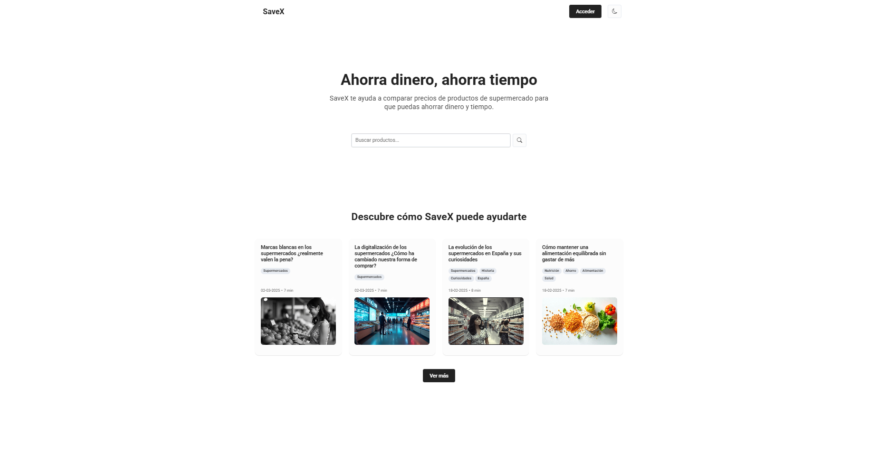

### Post Page
   Lists available blog posts about saving money and shopping tips. Users can browse and read various articles.
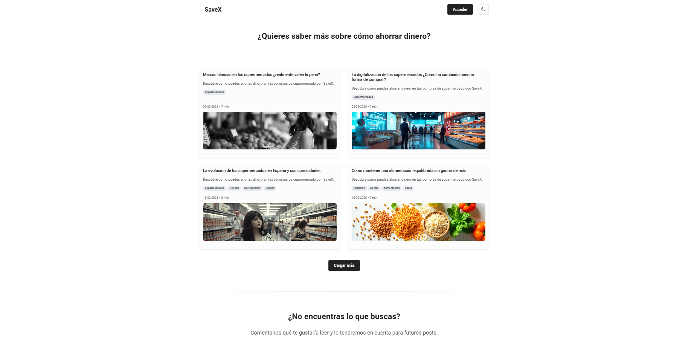

### Post Details
   Displays a full blog post with a comments section where users can interact by leaving feedback. 
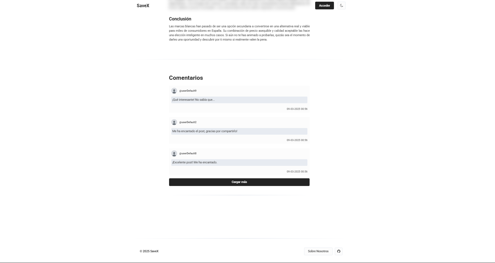

### Login/Register Page
   A dual-section screen allowing users to either sign in with their credentials or create a new account.
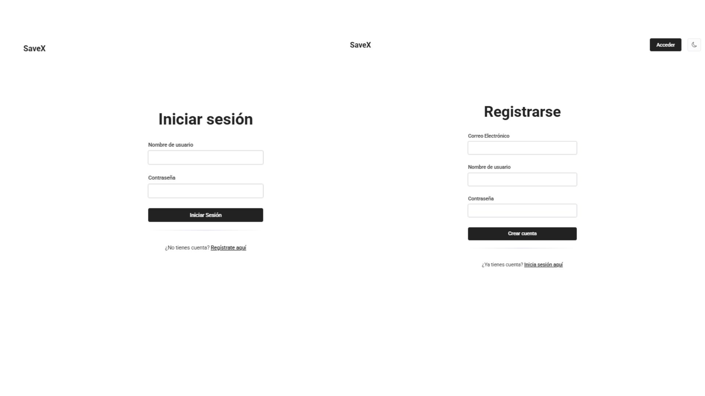

### Product Search Page
   A search interface where users can look up products, filter results by supermarket, and set price ranges to find the best deals.
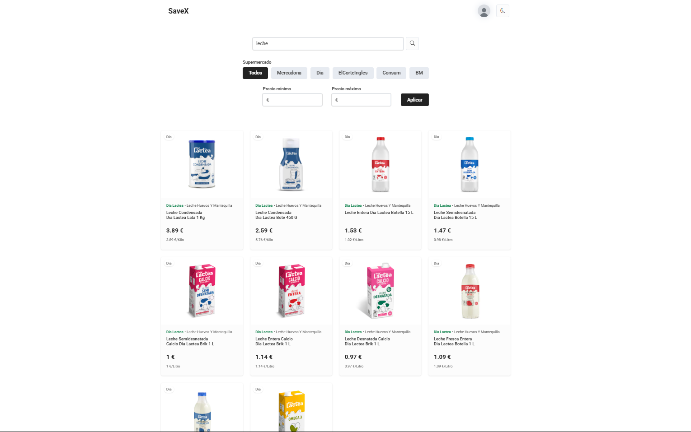

### Product Details 
   Provides detailed information about a selected product, including price comparisons from different supermarkets and related product recommendations.
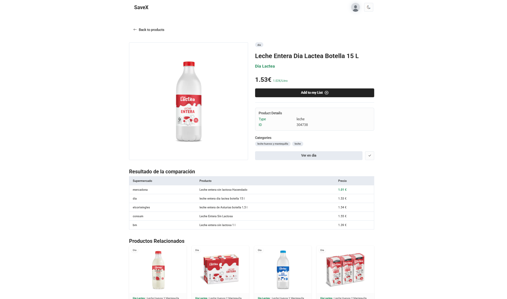

### Show List Page
   Shows a specific shopping list, including its description and added products. Users can add or remove products from the list.


### Profile Page
   Displays the user’s profile with their name, username, and account creation date. Users can manage their lists and access account settings.
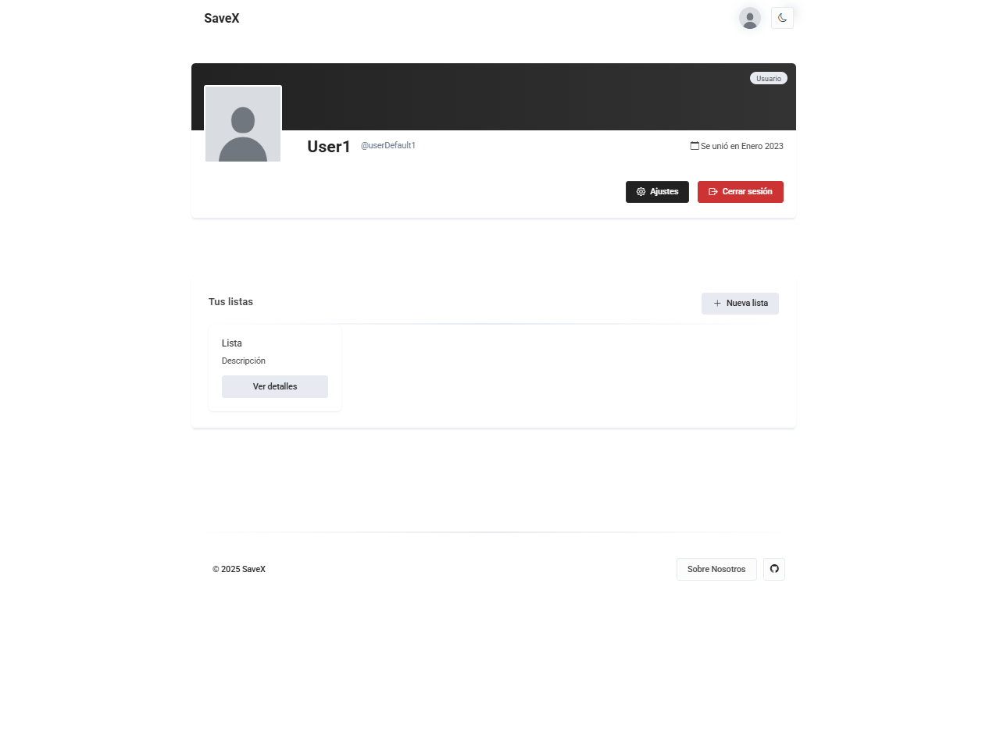

### Settings Page
   Users can update their profile information, such as name, email, and username. They can also change their password or delete their account.
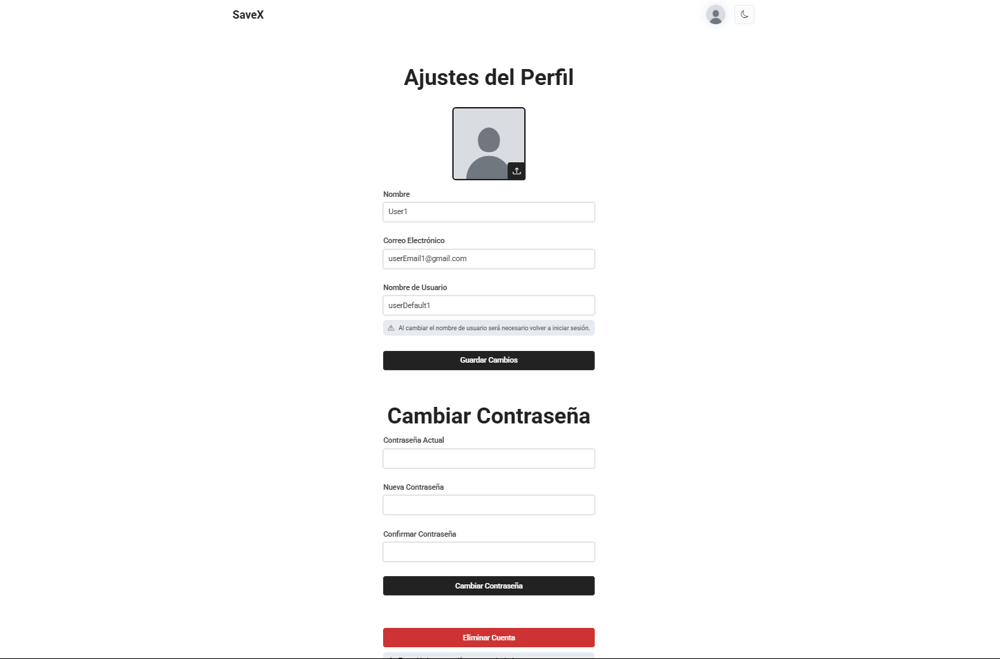

### Dashboard Page (Admin)
   An admin panel displaying app statistics, user management options, and a control panel for posts, allowing admins to delete users or content.
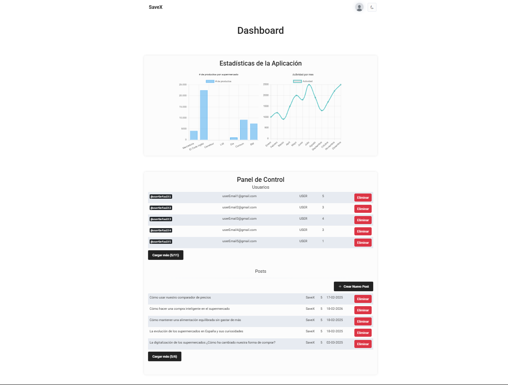

### Create New Post (Admin)
   A form where users (likely admins) can create new blog posts by entering details such as title, category, visibility, and content.
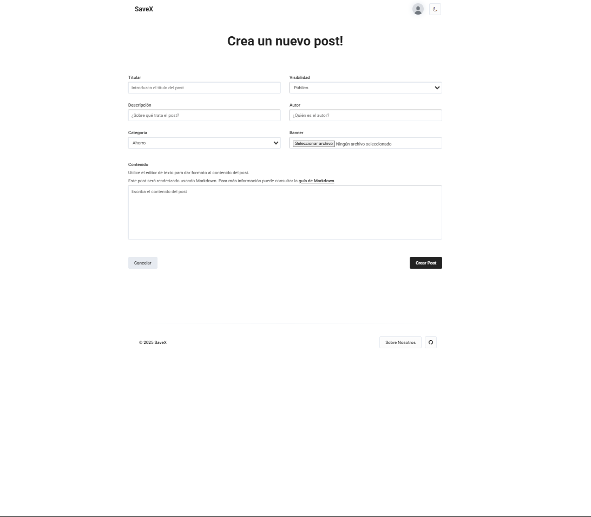

---

## 🗺️ Navigation Flow Diagram

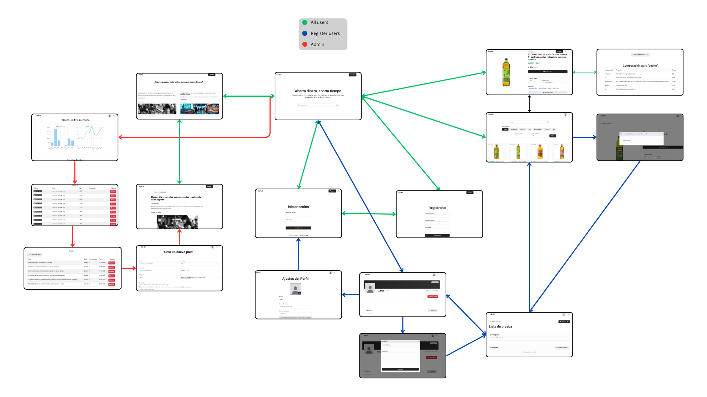

The following diagram represents the navigation flow and user interactions within our application. It provides a visual overview of the different pages and their accessibility based on user roles:

- **Green (All users)**: Pages accessible to both guests and registered users.
- **Blue (Registered users)**: Features that require user authentication.
- **Red (Admin)**: Sections restricted to administrators for content management and analytics.

The diagram illustrates the relationships between key components such as authentication, product browsing, user profile management, and administrative controls. This structure ensures a seamless user experience while maintaining proper role-based access control.

---

## 📐 Class Diagram and Templates

This diagram provides an overview of the application's structure, showing how different classes interact with each other and with the templates. It helps to understand the system architecture and facilitates code maintenance and evolution.

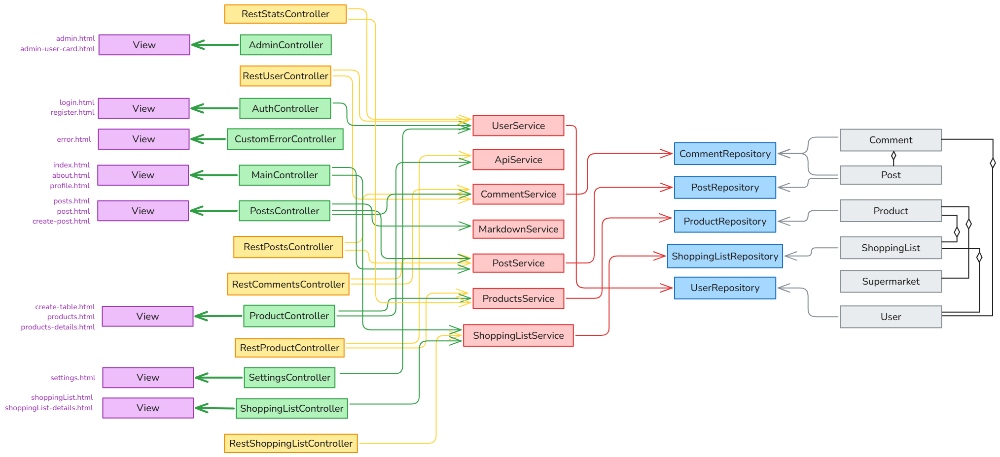

- **Green**: @Controller
- **Red**: @Service
- **Blue**: @Repository
- **Yellow**: Domain entities
- **Purple**: Templates

---
## 🗺️ SPA Class Diagram and Templates

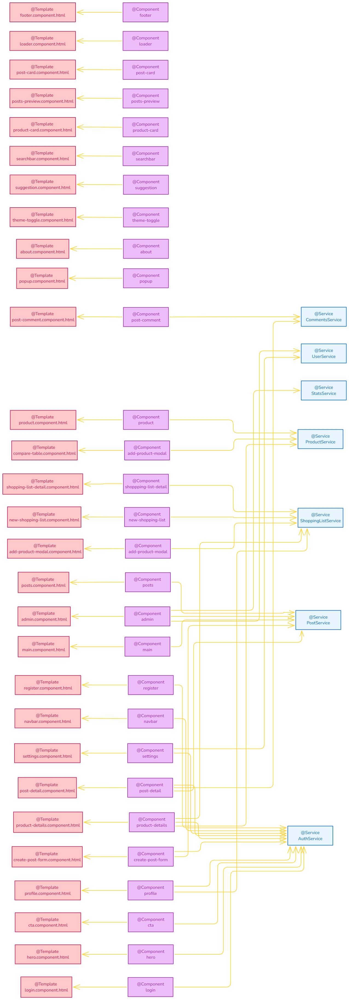

This diagram provides a visual representation of the application's component-service structure in Angular. It shows the connection between templates (@Template), components (@Component), and services (@Service), illustrating the frontend architecture:

- Components manage user interactions, routing, and UI behavior.
- Templates define the HTML structure for each component.
- Services handle business logic, data operations, and API communications.

The diagram covers core areas like authentication, product browsing, shopping list management, post and comment functionality, and administrative operations, ensuring a modular, scalable, and maintainable application design.

---

## ✋ Participation (I)

### 🧑‍💻 Victor Arroyo Madera

- Refactored the `RestShoppingListController` by removing unused imports and dependencies.
- Implemented REST endpoints to **create** and **delete** shopping lists, with proper request validation.
- Simplified controller methods and improved response structure for consistency across the shopping list API.
- Refactored product management within shopping lists to enhance response handling and ensure proper user validation.
- Created structured response DTOs like `ListResponse` to support better client integration.
- Updated and enhanced API security configuration, improving JWT token handling via headers and cookies.
- Improved API documentation for shopping list and user-related endpoints.
- Updated pagination DTO structure and added request DTOs for product search functionality.
- Removed deprecated demo content and outdated TODOs for cleaner, production-ready code.

#### Commits

| #   | Commit Message                                                                                                                                                                                                                             | File(s)                                         |
| --- | ------------------------------------------------------------------------------------------------------------------------------------------------------------------------------------------------------------------------------------------ | ----------------------------------------------- |
| 1º  | [refactor: Remove unused imports and dependencies in RestShoppingListController](https://github.com/CodeURJC-DAW-2024-25/webapp01/commit/47d3929b84b0915e01b7d3765e8f1a1344633570)                                                         | `RestShoppingListController.java`               |
| 2º  | [Feat: Implement create and delete shopping list endpoints with request validation](https://github.com/CodeURJC-DAW-2024-25/webapp01/commit/dcb6e7058c44edc5cc0861616a2eb18a2aed5eb6)                                                      | `RestShoppingListController.java`               |
| 3º  | [Feat: Simplify shopping list controller methods and enhance response handling](https://github.com/CodeURJC-DAW-2024-25/webapp01/commit/4c37cf2abfedf2af82277881fc950d223b1404c5)                                                          | `RestShoppingListController.java`               |
| 4º  | [Feat: Refactor addProductToList method to improve response handling and user validation; add listResponse DTO for structured responses](https://github.com/CodeURJC-DAW-2024-25/webapp01/commit/edb9e8e47ab8aec4c28ccd2cb6c633c127c460e1) | `ShoppingListService.java`, `ListResponse.java` |
| 5º  | [Feat: Update security configuration and improve API documentation for user and shopping list endpoints](https://github.com/CodeURJC-DAW-2024-25/webapp01/commit/8c930a2ca6cce42c0577bbb7829ad6c474f310b3)                                 | `SecurityConfig.java`, `JwtTokenProvider.java`  |

---

### 🧑‍💻 Diego Sánchez Rincón

- Developed the post management system, allowing administrators to create, edit, and delete blog posts.
- Implemented a Markdown Service to convert user input into formatted HTML content for blog posts.
- Implemented an API Service to unify API calls and handle data retrieval for product information.
- Integrated pagination with AJAX for blog posts, comments and product search results to enhance user experience.
- Created a Cache Frontend Service to store and retrieve data that is frequently accessed by users.
- Implemented a FetchData Frontend Service to unify backend API calls and handle caching for improved performance.
- Allow users to upload images for their profile picture without reloading the page.
- Database initial data population for testing purposes.
- Styling and design of the user interface for a consistent and visually appealing user experience.
- General code refactoring and optimization for improved performance and maintainability.

#### Commits

| #   | Commit Message                                                                                                                                                                       | File(s)                       |
| --- | ------------------------------------------------------------------------------------------------------------------------------------------------------------------------------------ | ----------------------------- |
| 1º  | [Feat: Enhance product search functionality with pagination and filtering options](https://github.com/CodeURJC-DAW-2024-25/webapp01/commit/39b45a556165f8f0bc64bfafbc1554c6d2c29bd9) | `ProductsController.java`     |
| 2º  | [feat: implement caching and data fetching services for improved product loading](https://github.com/CodeURJC-DAW-2024-25/webapp01/commit/2d4938816e715d7459ae460243f97677f49e37dd)  | `fetchService.js`             |
| 3º  | [Feat: Add Markdown rendering for post content and improve post detail styling](https://github.com/CodeURJC-DAW-2024-25/webapp01/commit/b1c044ef414ebf05bfa415f0df3aea2db59e2a9e)    | `MarkdownService.java`        |
| 4º  | [Refactor: Simplify product search logic and add REST API for product retrieval](https://github.com/CodeURJC-DAW-2024-25/webapp01/commit/9af21b67d5d57c3719fc01eefd3a8f559f38751c)   | `RestProductsController.java` |
| 5º  | [Feat: Implement load more functionality for posts with AJAX](https://github.com/CodeURJC-DAW-2024-25/webapp01/commit/f11117d03b020a4760ea32f113bea088e6fa5b7b)                      | `fetchPosts.js`               |

---

### 🧑‍💻 Jaime José Portillo Pérez

- Developed the searchbar algorithm
- Developed the suggested/related products algorithm
- Developed price caparator algorithm 
- Implemented admin dashboard
- Implemented admin commands
  - List all users
  - Delete user
  - List all posts
  - Delete post
- Implemented products and activity graphs

#### Commits

| #   | Commit Message                                                                                                                              | File(s)                   |
| --- | ------------------------------------------------------------------------------------------------------------------------------------------- | ------------------------- |
| 1º  | [feat: Comparation of products algorithm](https://github.com/CodeURJC-DAW-2024-25/webapp01/commit/d5dc344e1a5c87f4f257b2ac339fb010e24cfccb) | `ProductsController.java` |
| 2º  | [feat: async admin lists all users](https://github.com/CodeURJC-DAW-2024-25/webapp01/commit/29e9a135678693d7e119d0c0d89b82d77def7e23)       | `AdminController.java`    |
| 3º  | [feat: suggested products](https://github.com/CodeURJC-DAW-2024-25/webapp01/commit/a39956230e80f7e279362d97b53aacc0b0f00e3e)                | `suggestedProducts.js`    |
| 4º  | [posts page](https://github.com/CodeURJC-DAW-2024-25/webapp01/commit/e0d47f80fc6d64d4c631e108c7f0e4d6b7d178df)                              | `post-page.css`           |
| 5º  | [temp: admin controller](https://github.com/CodeURJC-DAW-2024-25/webapp01/commit/b11735b7d993995ff68252c1aa9c22788b12283e)                  | `adminGraphs.js`          |

---

### 🧑‍💻 Daniel Santos López

- Developed shopping list management features, allowing users to create, edit, and delete lists.
- Implemented the product addition and removal functionality for shopping lists, enabling users to manage their items.
- Implemented modals for dynamic list creation and dynamic product addition to list.  
- Styled the profile page and settings page for a consistent and intuitive user interface.
- Implemented popups for user feedback and error messages to enhance the user experience.
- Developed the settings page for users to manage their profile information, change passwords, and delete accounts.
- Started implementing avatar upload functionality for user profiles.
- Added validation and error handling to the user registration and login forms to ensure data integrity.
- Implmented functionality to save post banner image
  
#### Commits

| #   | Commit Message                                                                                                                                                                             | File(s)                           |
| --- | ------------------------------------------------------------------------------------------------------------------------------------------------------------------------------------------ | --------------------------------- |
| 1º  | [Feat: add functionality to add products to user shopping lists](https://github.com/CodeURJC-DAW-2024-25/webapp01/commit/a82167b9da77a8143a338e10d452245a38078df0)                         | `RestShoppingListController.java` |
| 2º  | [Feat: Add validation to user registration and enhance error handling in AuthController](https://github.com/CodeURJC-DAW-2024-25/webapp01/commit/31e6646e9b078231f67172c304ab2169dc8878c2) | `AuthController.java`             |
| 3º  | [Feat: implemented functionality to change user password with validations](https://github.com/CodeURJC-DAW-2024-25/webapp01/commit/46934c4313ce00c01b78011202c0791b4e65a241)               | `SettingsController.java`         |
| 4º  | [Feat: Implement error handling on the login page with an informational popup](https://github.com/CodeURJC-DAW-2024-25/webapp01/commit/b7c99685582431a51b59e4db1163ce7b14f714f6)           | `AuthController.java`             |
| 5º  | [Feat: Implement avatar upload and retrieval functionality in user profile](https://github.com/CodeURJC-DAW-2024-25/webapp01/commit/692e38cb735211884a484f55f920f1c425783592)              | `RestUserController.java`         |

---

### 🧑‍💻 Elena Tordesillas Fernández

 - Developed the admin command implementation, allowing administrators to manage system settings efficiently.
 - Implemented post creation functionality, enabling users to publish content seamlessly.
 - Developed post editing functionality, allowing users to modify their posts easily.
 - Developed the user command implementation, providing users with intuitive controls for managing their data.
 - Developed the delete product list feature, ensuring users can remove unnecessary lists effortlessly.


#### Commits

| #   | Commit Message                                                                                                                                                                          | File(s)                       |
| --- | --------------------------------------------------------------------------------------------------------------------------------------------------------------------------------------- | ----------------------------- |
| 1º  | [feat: add post editing functionality and improve create post form with dynamic data](https://github.com/CodeURJC-DAW-2024-25/webapp01/commit/12591602dc594ffc4e200eb85645138adb4197fc) | `PostController.java`         |
| 2º  | [feat: add delete functionality for shopping lists](https://github.com/CodeURJC-DAW-2024-25/webapp01/commit/1e5c1d66ffc3767d33f1acc945fd1ff2bb2d26ba)                                   | `ShoppingListController.java` |
| 3º  | [add shoppingList to profile](https://github.com/CodeURJC-DAW-2024-25/webapp01/commit/b42fd5a48afc1c7900601da7dc5f46bc598ee2e9)                                                         | `ShoppingListController.java` |
| 4º  | [create post](https://github.com/CodeURJC-DAW-2024-25/webapp01/commit/1ee42e5f7d7707a41e6d0717980a9f648848ea82)                                                                         | `PostController.java`         |
| 5º  | [modify admin page](https://github.com/CodeURJC-DAW-2024-25/webapp01/commit/2aed99e040d5306430295832bc4fbe46c23111c7)                                                                   | `admin.html`                  |

---

## ✋ Participation (II)

### Victor Arroyo Madera

- Refactored the `RestShoppingListController` by removing unused imports and dependencies.
- Implemented REST endpoints to **create** and **delete** shopping lists, with proper request validation.
- Simplified controller methods and improved response structure for consistency across the shopping list API.
- Refactored product management within shopping lists to enhance response handling and ensure proper user validation.
- Created structured response DTOs like `ListResponse` to support better client integration.
- Updated and enhanced API security configuration, improving JWT token handling via headers and cookies.
- Improved API documentation for shopping list and user-related endpoints.
- Updated pagination DTO structure and added request DTOs for product search functionality.
- Removed deprecated demo content and outdated TODOs for cleaner, production-ready code.

#### Commits

| #  | Commit Message                                                                                                                                                                      | File(s)                           |
|----|-------------------------------------------------------------------------------------------------------------------------------------------------------------------------------------|-----------------------------------|
| 1º | [refactor: Remove unused imports and dependencies in RestShoppingListController](https://github.com/CodeURJC-DAW-2024-25/webapp01/commit/47d3929b84b0915e01b7d3765e8f1a1344633570) | `RestShoppingListController.java`|
| 2º | [Feat: Implement create and delete shopping list endpoints with request validation](https://github.com/CodeURJC-DAW-2024-25/webapp01/commit/dcb6e7058c44edc5cc0861616a2eb18a2aed5eb6) | `RestShoppingListController.java`|
| 3º | [Feat: Simplify shopping list controller methods and enhance response handling](https://github.com/CodeURJC-DAW-2024-25/webapp01/commit/4c37cf2abfedf2af82277881fc950d223b1404c5) | `RestShoppingListController.java`|
| 4º | [Feat: Refactor addProductToList method to improve response handling and user validation; add listResponse DTO for structured responses](https://github.com/CodeURJC-DAW-2024-25/webapp01/commit/edb9e8e47ab8aec4c28ccd2cb6c633c127c460e1) | `ShoppingListService.java`, `ListResponse.java` |
| 5º | [Feat: Update security configuration and improve API documentation for user and shopping list endpoints](https://github.com/CodeURJC-DAW-2024-25/webapp01/commit/8c930a2ca6cce42c0577bbb7829ad6c474f310b3) | `SecurityConfig.java`, `JwtTokenProvider.java` |

---

### 🧑‍💻 Jaime José Portillo Pérez

- API REST Endpoints for admin features (users and posts management).
  - Delete user.
  - List all users.
  - List all posts.
- Swagger documentation for (comments, shopping list controller, posts).
- Developed the APIResponseDTO class.
  - Normalized all the API responses using the APIResponseDTO class.
  - ApiError class for error responses.
- Created several API queries in Postman to test the API.
  - Added Postman tests dedicated for every query.
- Server management and deployment with Docker (developed alongside Diego).
  - Developed the DockerFile and DockerCompose file.
  - Deployed the server on ETSII server.
- Removed sensitive information from API responses (passwords).

#### ✅ Top 5 Most Significant Commits

| #  | Commit Message | Most Significant File |
|----|----------------|-----------------------|
| 1º | [merge: admin features (admin endpoints)](https://github.com/CodeURJC-DAW-2024-25/webapp01/commit/6aa01b5) | `ApiResponseDTO.java` |
| 2º | [postman: posts batch tests](https://github.com/CodeURJC-DAW-2024-25/webapp01/commit/e99a1c0) | `postman-batch-test.json` |
| 3º | [Swagger annotations (comments, posts, shoppinglist) - Added 404 code in the corresponding routes](https://github.com/CodeURJC-DAW-2024-25/webapp01/commit/96ee9bc) | `RestPostsController.java` |
| 4º | [api: normalized endpoints and fixed errors](https://github.com/CodeURJC-DAW-2024-25/webapp01/commit/1cee1ad) | `RestUserController.java` |
| 5º | [postman: batch test for unauthorized & users - api: create users from API](https://github.com/CodeURJC-DAW-2024-25/webapp01/commit/7ec81bd) | `postman-batch-test.json` |

---

### 🧑‍💻 Diego Sánchez Rincón

- Contribute to the creation of the Postman collection.  
- Initial API configuration.  
- Features related to posts (mappers, DTOs, endpoints).
- Features related to comments (mappers, DTOs, endpoints).
- Utilities for centralized date formatting.
- Dockerfile and docker-compose files.
- Standardization of product models for interaction with the database and external API.  
- Endpoints to query advanced algorithms (suggested products and price comparison).  
- Code cleanup and optimization.  
- Generation of OpenAPI documentation and web route access.  
- Contribution to shopping list functionalities.  
- Help unify form field validation.  
- Endpoints to retrieve app chart statistics.  

#### ✅ Top 5 Most Significant Commits

| #   | Commit Message                                                                                                                                                                                                              | File(s)                                               |
| --- | --------------------------------------------------------------------------------------------------------------------------------------------------------------------------------------------------------------------------- | ----------------------------------------------------- |
| 1º  | [Docker: Add Dockerfile and docker-compose config](https://github.com/CodeURJC-DAW-2024-25/webapp01/commit/bd6692a7abe899f6b0da640fb3e6f00096949307)                                                                        | `Dockerfile` & `docker-compose.yml`                   |
| 2º  | [Feature: Add ComparationAlgorithm and LevenshteinUtils for product comparison logic](https://github.com/CodeURJC-DAW-2024-25/webapp01/commit/fba4bf0bbe2f34d0d11532104f8ae2f0c88fd972)                                     | `ComparationAlgorithm.java` & `LevenshteinUtils.java` |
| 3º  | [Feat: Implement post creation and update functionality with enhanced reading time calculation and security restrictions](https://github.com/CodeURJC-DAW-2024-25/webapp01/commit/a4388fade19c56898c1936187a40e98b8888dde3) | `RestPostsController.java` & `PostMapper.java`        |
| 4º  | [feat: Add OpenAPI generator configuration and update API documentation settings](https://github.com/CodeURJC-DAW-2024-25/webapp01/commit/5da2003ddbd42405b98c68c18e8e990dfebf8c5e)                                         | `pom.xml` & `application.properties`                  |
| 5º  | [Refactor: Enhance user modification validation and update UserMapper to support partial updates](https://github.com/CodeURJC-DAW-2024-25/webapp01/commit/7b255e26acbaa6d95eeae046dfa90cf5465e3c02)                         | `ValidationUtils.java` & `UserMapper.java`            |

---

### 🧑‍💻 Daniel Santos López

- Added Swagger/OpenAPI annotations to enhance API documentation.
- Refactored Postman collection for better organization.
- Simplified validation logic in ValidationUtils.
- Refactored user registration and added validation utilities.
- Implemented user registration with security updates.
- Added modifyPassword method and updated user modification logic with DTOs.
- Implemented user profile management endpoints.
- Implemented avatar management endpoints: upload, modify, delete, and retrieval.

#### ✅ Top 5 Most Significant Commits

| #   | Commit Message                                                                                                                                                                                                    | File(s)                                       |
| --- | ----------------------------------------------------------------------------------------------------------------------------------------------------------------------------------------------------------------- | --------------------------------------------- |
| 1º  | [feat: Enhance API documentation with OpenAPI annotations for product endpoints](https://github.com/CodeURJC-DAW-2024-25/webapp01/commit/46d61484c4aa9d5a86ce10189aa6f31e5d5a10c3)                                | `RestProductsController`&`RestUserController` |
| 2º  | [Postman: Refactor, group the API into folders, and structure the request format.](https://github.com/CodeURJC-DAW-2024-25/webapp01/commit/2f0c1ffbf31c065bfea740c2fbc49acedacb79f0)                              | `SaveX Postman Collection`                    |
| 3º  | [Refactor: add user modification DTOs and update user modification logic in UserService and RestUserController](https://github.com/CodeURJC-DAW-2024-25/webapp01/commit/ccf2c11ecd7aae6b59ce5fca3101d9196a4aae36) | `RestUserController` & `UserMapper.java`      |
| 4º  | [Feat: Implement user avatar management endpoints for upload, modification, and deletion](https://github.com/CodeURJC-DAW-2024-25/webapp01/commit/55800849c4af520d897b7fb1abb05ebfb5606db6)                       | `RestUserController`                          |
| 5º  | [Feat: Implement user avatar management endpoints for upload, modification, and deletion](https://github.com/CodeURJC-DAW-2024-25/webapp01/commit/5befe6a9cde87125d850c48410a55d38cbc6b1da)                       | `ValidationUtils.java` & `UserMapper.java`    |

---

### 🧑‍💻 Elena Tordesillas Fernández

- Implemented endpoints for retrieving and updating shopping lists.
- Implemented update comment functionality.
- Improved list creation and deletion functionality.
- Added activity data management.
- Updated API documentation for shopping list operations.
- Enhanced Postman collection with dynamic API URLs and new test queries.

#### ✅ Top 5 Most Significant Commits

| #   | Commit Message                                                                                                                                                                          | File(s)                       |
| --- | --------------------------------------------------------------------------------------------------------------------------------------------------------------------------------------- | ----------------------------- |
| 1º  | [feat: Implement update comment functionality](https://github.com/CodeURJC-DAW-2024-25/webapp01/commit/c9c9617efd546dadc2bb7ccdaf67afd09bd5faad) | `CommentService.java`         |
| 2º  | [feat: Add list update method and fix list deletion](https://github.com/CodeURJC-DAW-2024-25/webapp01/commit/795b4739bb413b2d2dbf29c83251263f17bdd184)                                   | `RestShoppingListController` |
| 3º  | [feat: Implement activity data](https://github.com/CodeURJC-DAW-2024-25/webapp01/commit/1fe95f225004179140b74c14c0dc219a71d55c09)                                                         | `RestProductController` |
| 4º  | [feat: Update API documentation PATCH methods in shopping list](https://github.com/CodeURJC-DAW-2024-25/webapp01/commit/e8ede751c72eb09f01a3a2a9904231fc2fd56b5d)                                                                         | `SaveX API.postman_collection.json`         |
| 5º  | [feat: Update CreateList endpoint to use ModelAttribute and modify Postman collection for form data](https://github.com/CodeURJC-DAW-2024-25/webapp01/commit/12ac0c86b76a1755b8bf0f351b5a6b3d2cb5a4d8)                                                                   | `SaveX API.postman_collection.json`                  |

---

## ✋ Participation (III)

### Victor Arroyo Madera

- Implemented **add-to-list popup component** and integrated product addition to shopping lists.
- Refactored the **create shopping list modal**, improving event handling for new list creation.
- Created **CreateShoppingListComponent** with form validation and routing to allow users to create new shopping lists.
- Developed **ShoppingListDetailsComponent** to enable viewing and deletion of shopping lists with integrated service communication.
- Removed the item count display from **shopping list cards** to simplify UI and improve user experience.
- Developed the **Products module** entirely in Angular, including:
  - Product listing view with **search, filtering, and pagination**.
  - **Product details page** with related products section.
  - Service integration for **fetching and managing product data**.
  - Improved UI/UX with default images and clean routing between product pages.

#### Commits

| #  | Commit Message                                                                                                                                                                      | File(s)                           |
|----|-------------------------------------------------------------------------------------------------------------------------------------------------------------------------------------|-----------------------------------|
| 1º | [feat: implement add-to-list popup component and integrate product addition to shopping lists](https://github.com/CodeURJC-DAW-2024-25/webapp01/commit/09c7b6b7f84ead114be9d8329793655cb8491ecc) | `AddToListPopupComponent.tsx`, `ShoppingListService.ts` |
| 2º | [feat: refactor create shopping list modal and integrate list creation event handling](https://github.com/CodeURJC-DAW-2024-25/webapp01/commit/543dca94fbf9cd64862279a769bc12c0a2dce58f) | `CreateShoppingListModal.tsx` |
| 3º | [Feature: add CreateShoppingListComponent for creating new shopping lists with form validation and routing](https://github.com/CodeURJC-DAW-2024-25/webapp01/commit/109ee0e4c6e6b659cde1e7c7959d2c3d3afb6656) | `CreateShoppingListComponent.tsx`, `app-routing.module.ts` |
| 4º | [Feature: add ShoppingListDetailsComponent with routing and service integration for viewing and deleting shopping lists](https://github.com/CodeURJC-DAW-2024-25/webapp01/commit/pendiente_url) | `ShoppingListDetailsComponent.tsx`, `ShoppingListService.ts` |
| 5º | [Refactor: implement getter/setter for search query in products component](https://github.com/CodeURJC-DAW-2024-25/webapp01/commit/17d36cc3cf5d5ed5e7ad1d79d13168db5ea7236e) | `ProductsComponent.tsx`, `ProductService.ts`, `ProductCard.tsx` |

---

### 🧑‍💻 Jaime José Portillo Pérez


#### ✅ Top 5 Most Significant Commits

| #  | Commit Message                                                                                                                                                                      | File(s)                           |
|----|-------------------------------------------------------------------------------------------------------------------------------------------------------------------------------------|-----------------------------------|
| 1º | []() | |
| 2º | []() | |
| 3º | []() | |
| 4º | []() | |
| 5º | []() | |

---

### 🧑‍💻 Diego Sánchez Rincón


#### ✅ Top 5 Most Significant Commits

| #  | Commit Message                                                                                                                                                                      | File(s)                           |
|----|-------------------------------------------------------------------------------------------------------------------------------------------------------------------------------------|-----------------------------------|
| 1º | []() | |
| 2º | []() | |
| 3º | []() | |
| 4º | []() | |
| 5º | []() | |

---

### 🧑‍💻 Daniel Santos López


#### ✅ Top 5 Most Significant Commits

| #  | Commit Message                                                                                                                                                                      | File(s)                           |
|----|-------------------------------------------------------------------------------------------------------------------------------------------------------------------------------------|-----------------------------------|
| 1º | []() | |
| 2º | []() | |
| 3º | []() | |
| 4º | []() | |
| 5º | []() | |

---

### 🧑‍💻 Elena Tordesillas Fernández

- Created AdminComponent with user and post management functionality.
   - Added charts to the admin panel for product and user statistics.
- Created create-postComponent
   - Added edit post functionality.
   - Added create post functionality.


#### ✅ Top 5 Most Significant Commits

| #  | Commit Message                                                                                                                                                                      | File(s)                           |
|----|-------------------------------------------------------------------------------------------------------------------------------------------------------------------------------------|-----------------------------------|
| 1º | [feat: add AdminComponent with user and post management functionality](https://github.com/CodeURJC-DAW-2024-25/webapp01/commit/8ce4c3f755f0da61433c2c38653a4eb2fae46132) |`admin.component.html`|
| 2º | [Feature: Add create post functionality](https://github.com/CodeURJC-DAW-2024-25/webapp01/commit/3537cc3d5168c8585f961e8fd8568ea3fc986e3c) |`create-post-form.html`|
| 3º | [Feature: Add edit post functionality](https://github.com/CodeURJC-DAW-2024-25/webapp01/commit/97079f663dd42c33949db9021ae8614f080799a8) |`create-post-form.ts`|
| 4º | [feat: add charts to admin panel for product and user statistics](https://github.com/CodeURJC-DAW-2024-25/webapp01/commit/8200a27abb86b3ed1079d32622d59feed8b3146b) |`admin.component.ts`|
| 5º | [Feature: update post with banner](https://github.com/CodeURJC-DAW-2024-25/webapp01/commit/a7a3f7660863d17387bff5e61a1af1ebf4f7c167) |`create-post-form.ts`|

---


## 📄 License

```
Licensed under the Apache License, Version 2.0 (the "License");
you may not use this file except in compliance with the License.
You may obtain a copy of the License at

    http://www.apache.org/licenses/LICENSE-2.0

Unless required by applicable law or agreed to in writing, software
distributed under the License is distributed on an "AS IS" BASIS,
WITHOUT WARRANTIES OR CONDITIONS OF ANY KIND, either express or implied.
See the License for the specific language governing permissions and
limitations under the License.
```

---