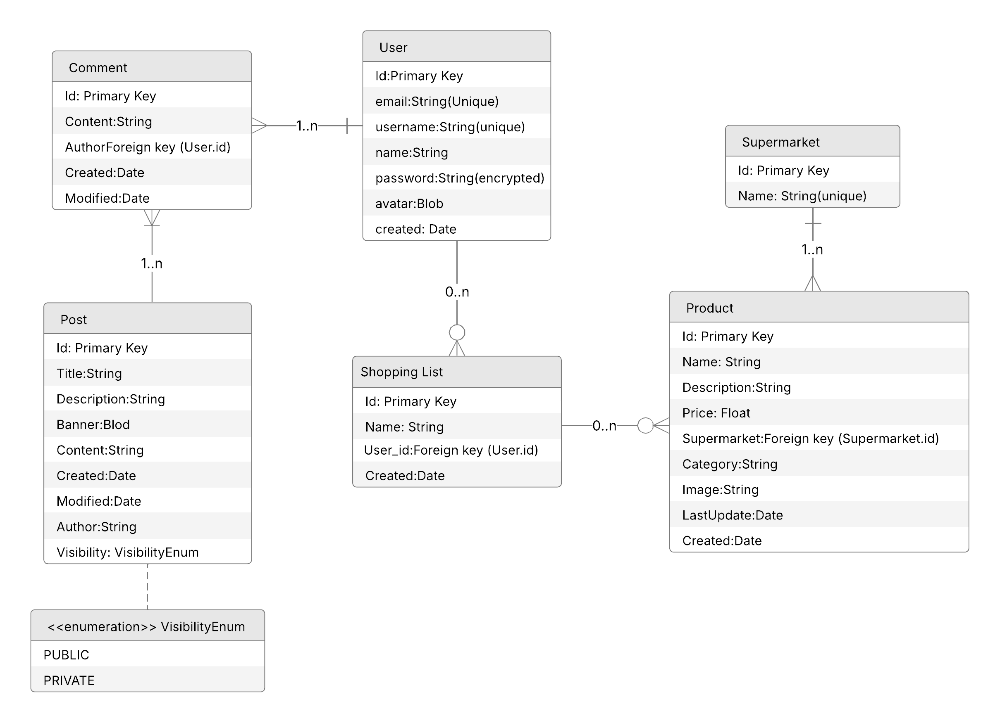

# 🚀 SaveX - Pricing Comparison Platform

SaveX is a platform that allows users to compare the prices of products between different supermarkets. Users can create shopping lists, add products to them, and compare pricings between the different supermarkets to save money.

---

## 📎 Credits

| Name                        | URJC Mail                          | LinkedIn                                                            | Github                                              |
| --------------------------- | ---------------------------------- | ------------------------------------------------------------------- | --------------------------------------------------- |
| Daniel Santos López         | d.santos.2022@alumnos.urjc.es      | [Daniel Santos](https://www.linkedin.com/in/danisntoss/)            | [danisntoss](https://github.com/danisntoss)         |
| Elena Tordesillas Fernández | e.tordesillas.2022@alumnos.urjc.es | [Elena Tordesillas](https://www.linkedin.com/in/elena-tordesillas/) | [elenxt4](https://github.com/elenxt4)               |
| Diego Sánchez Rincón        | d.sanchezr.2022@alumnos.urjc.es    | [Diego Sánchez](https://www.linkedin.com/in/cub1z/)                 | [CuB1z](https://github.com/CuB1z)                   |
| Victor Arroyo Madera        | v.arroyom.2021@alumnos.urjc.es     | [Victor Arroyo](https://www.linkedin.com/in/victorarroyomadera/)    | [victorrosalejo](https://github.com/victorrosalejo) |
| Jaime Portillo Pérez        | jj.portillo.2022@alumnos.urjc.es   | [Jaime Portillo](https://www.linkedin.com/in/porti/)                | [PortiESP](https://github.com/PortiESP)             |

---

## 📌 Main Aspects

For team coordination, we will be using Notion. This tool will help us keep track of the project's progress, the tasks assigned to each member, and the deadlines. You can find our Notion workspace at the following URL: [Notion Workspace](https://urjc-pepe.notion.site/Proyecto-Supermercados-18f1e90b533080c7bbd0d957154de396?pvs=4)

---

## 📦 Entities

### 👤 User

| Field    | Type                |
|----------|---------------------|
| id       | Primary key         |
| email    | String (unique)     |
| username | String (unique)     |
| name     | String              |
| password | String (encrypted)  |
| avatar   | Blob                |
| created  | Date                |

### 🛒 Supermarket

| Field    | Type            |
|----------|-----------------|
| id       | Primary key     |
| name     | String (unique) |

### 🛍️ Product (For caching data)

| Field        | Type                        |
|--------------|-----------------------------|
| id           | Primary key                 |
| name         | String                      |
| description  | String                      |
| price        | Float                       |
| supermarket  | Foreign key (Supermarket.id)|
| category     | String                      |
| image        | String                      |
| last_updated | Date                        |
| created      | Date                        |

### 📝 Shopping List

| Field     | Type                        |
|-----------|-----------------------------|
| id        | Primary key                 |
| name      | String                      |
| user_id   | Foreign key (User.id)       |
| created   | Date                        |

### 📝 Post

| Field       | Type                      |
|-------------|-------------------------- |
| id          | Primary key               |
| title       | String                    |
| description | String                    |
| banner      | Blob                      |
| content     | String                    |
| created     | Date                      |
| modified    | Date                      |
| author      | String                    |
| visibility  | Enum (public, private)    |

### 💬 Comment

| Field     | Type                        |
|-----------|-----------------------------|
| id        | Primary key                 |
| content   | String                      |
| author    | Foreign key (User.id)       |
| created   | Date                        |
| modified  | Date                        |

---

## 📐 Database Schema Diagram

The following diagram illustrates the structure of our database, including tables, relationships, and key constraints:



This schema provides an overview of how different entities interact within the system. It helps in understanding the data flow and ensuring efficient database design.

---

## 🔒 User Permissions

| Permission                                       | Anonymous User | Registered User | Admin User |
| ------------------------------------------------ | -------------- | --------------- | -----------|
| Can view homepage                                | ✅             | ✅              | ✅         |
| Can view products                                | ✅             | ✅              | ✅         |
| Can view product details                         | ✅             | ✅              | ✅         |
| Can search for products                          | ✅             | ✅              | ✅         |
| Can compare products                             | ✅             | ✅              | ✅         |
| Can view posts and comments                      | ✅             | ✅              | ✅         |
| Can create / edit / delete own profile           | ❌             | ✅              | ✅         |
| Can create / edit / delete shopping lists        | ❌             | ✅              | ✅         |
| Can create / edit / delete comments              | ❌             | ✅              | ✅         |
| Can manage other users' accounts                 | ❌             | ❌              | ✅         |
| Can view user activity logs                      | ❌             | ❌              | ✅         |
| Can create / edit / delete posts                 | ❌             | ❌              | ✅         |

---

## 🖼️ Images

- Users will be able to upload images to set a profile picture.
- Products will have images provided by the supermarkets API.
- Shopping lists will have a default image. Users will be able to upload images to set a custom image.
- Posts will have a banner image.

---

## 📊 Graphics

- We will use various charts and graphs to visualize the price comparisons between different supermarkets.
- The platform will provide visual insights into the most cost-effective supermarkets for a given shopping list.

---

## 🛠️ Additional Technology

- **APIs**: We will use a supermarket API to get the products and their details (prices, descriptions, etc).
- **PDF Generation** (Optional): Implement a feature to generate a PDF with the shopping list from the user.

---

## 🧠 Algorithm

- **Price Comparison**: We will implement an algorithm to compare the prices of the products in the shopping list between the different supermarkets.
- **Recommendation System**: We will implement a recommendation system to suggest products to the users based on the current product being viewed or added to the shopping list.

  ### 🔎 Price Comparison Algorithm

    The price comparison algorithm used in SaveX is designed to find the most suitable product match across different supermarkets. This is essential for ensuring that the user is comparing the same or very similar products between stores, even if the product names or packaging differ slightly.
    
    #### Steps of the Algorithm
    
    1. **Text Normalization**  
       Both the target product name (from the user's search) and the candidate product names (fetched from the API) are **normalized**. This involves:
       - Removing accents and special characters.
       - Converting to lowercase.
       - Removing extra spaces.
    
    2. **Quantity Extraction**  
       If the product name contains a quantity (e.g., "1L", "500g"), the algorithm extracts this value to improve comparison accuracy.
    
    3. **Similarity Calculation**  
       The core of the algorithm calculates a **weighted similarity score** for each candidate product. This score is composed of:
       - **Name Similarity** (60% weight) — Uses Levenshtein Distance to calculate how similar the normalized product names are.
       - **Brand Similarity** (20% weight) — Direct match comparison between brands (if available).
       - **Quantity Similarity** (10% weight) — Compares product quantities when available (e.g., 500g vs 1kg).
    
    4. **Best Match Selection**  
       After computing the weighted similarity score for all candidates, the algorithm selects the product with the **highest score**, provided it exceeds a predefined similarity threshold (e.g., 0.4). If no product meets the threshold, no match is returned.
    
    #### Key Factors Considered
    
    | Factor              | Weight  | Description                                                                 |
    |--------------------|--------|-----------------------------------------------------------------------------|
    | Product Name       | 60%    | Main criterion; higher similarity means better match.                       |
    | Brand              | 20%    | Exact match = 100% similarity; no brand = neutral (50% similarity).         |
    | Quantity           | 10%    | Compares numeric quantities (e.g., 1L vs 500ml); closer quantities score higher. |
    
    #### Example
    
    If the user searches for "Coca-Cola 1.5L" and we have the following candidates:
    
    | Candidate Name          | Brand      | Quantity | Name Similarity | Brand Similarity | Quantity Similarity | Final Score |
    |----------------------|-----------|----------|----------------|----------------|------------------|------------|
    | Coca-Cola Zero 1L     | Coca-Cola | 1L       | 0.85           | 1.0            | 0.67             | 0.84       |
    | Pepsi 1.5L            | Pepsi     | 1.5L     | 0.70           | 0.0            | 1.0              | 0.58       |
    | Coca-Cola 1.5L       | Coca-Cola | 1.5L     | 0.95           | 1.0            | 1.0              | 0.97       |
    
    In this case, the algorithm would correctly choose "Coca-Cola 1.5L" as the best match.
    

## 🗺️ Navigation Flow Diagram

!(docs/Navigation_Flow_Diagram.png)

The following diagram represents the navigation flow and user interactions within our application. It provides a visual overview of the different pages and their accessibility based on user roles:

- **Green (All users)**: Pages accessible to both guests and registered users.
- **Blue (Registered users)**: Features that require user authentication.
- **Red (Admin)**: Sections restricted to administrators for content management and analytics.

The diagram illustrates the relationships between key components such as authentication, product browsing, user profile management, and administrative controls. This structure ensures a seamless user experience while maintaining proper role-based access control.

---

## 📄 License

```
Licensed under the Apache License, Version 2.0 (the "License");
you may not use this file except in compliance with the License.
You may obtain a copy of the License at

    http://www.apache.org/licenses/LICENSE-2.0

Unless required by applicable law or agreed to in writing, software
distributed under the License is distributed on an "AS IS" BASIS,
WITHOUT WARRANTIES OR CONDITIONS OF ANY KIND, either express or implied.
See the License for the specific language governing permissions and
limitations under the License.
```