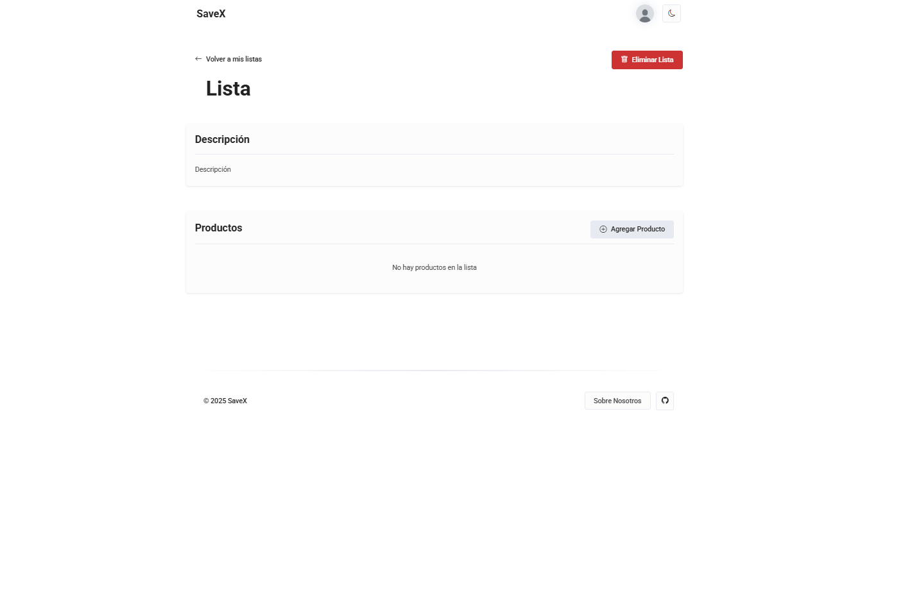

# 🚀 SaveX - Pricing Comparison Platform

SaveX is a platform that allows users to compare the prices of products between different supermarkets. Users can create shopping lists, add products to them, and compare pricings between the different supermarkets to save money.

---

## 📎 Credits

| Name                        | URJC Mail                          | LinkedIn                                                            | Github                                              |
| --------------------------- | ---------------------------------- | ------------------------------------------------------------------- | --------------------------------------------------- |
| Daniel Santos López         | d.santos.2022@alumnos.urjc.es      | [Daniel Santos](https://www.linkedin.com/in/danisntoss/)            | [danisntoss](https://github.com/danisntoss)         |
| Elena Tordesillas Fernández | e.tordesillas.2022@alumnos.urjc.es | [Elena Tordesillas](https://www.linkedin.com/in/elena-tordesillas/) | [elenxt4](https://github.com/elenxt4)               |
| Diego Sánchez Rincón        | d.sanchezr.2022@alumnos.urjc.es    | [Diego Sánchez](https://www.linkedin.com/in/cub1z/)                 | [CuB1z](https://github.com/CuB1z)                   |
| Victor Arroyo Madera        | v.arroyom.2021@alumnos.urjc.es     | [Victor Arroyo](https://www.linkedin.com/in/victorarroyomadera/)    | [victorrosalejo](https://github.com/victorrosalejo) |
| Jaime Portillo Pérez        | jj.portillo.2022@alumnos.urjc.es   | [Jaime Portillo](https://www.linkedin.com/in/porti/)                | [PortiESP](https://github.com/PortiESP)             |

---

## 🚀 Getting Started

To get started with SaveX, follow these steps:

### 🛠️ Prerequisites

| Technology | Version | Description                                                   |
|------------|---------|---------------------------------------------------------------|
| Java       | 21      | Programming language used for backend development.            |
| Spring Boot| 3.4.3   | Framework for building Java-based enterprise applications.    |
| MySQL      | 8.0.33  | Relational database management system for data storage.       |
| Maven      | 3.8.3+  | Build automation tool used for managing project dependencies. |

### 🏗️ Installation and Set Up

1.  **Clone the repository**
```bash
git clone https://github.com/CodeURJC-DAW-2024-25/webapp01.git SaveX --branch main --depth 1
cd ./SaveX/backend
```

2. **Install MySQL**
Download and install MySQL from the official website: [MySQL Downloads](https://dev.mysql.com/downloads/).
Once installed, create a new database named `savexdb`.

3. **Set up the application properties**
Open the `src/main/resources/application.properties` file and configure the database connection settings by replacing the placeholders with your MySQL configuration:
```properties
spring.datasource.url=jdbc:mysql://localhost:3306/savexdb
spring.datasource.username=root
spring.datasource.password={{your_password}}
spring.datasource.driver-class-name=com.mysql.cj.jdbc.Driver

spring.jpa.hibernate.ddl-auto={{create-drop|update}}
spring.jpa.show-sql=true
spring.jpa.properties.hibernate.dialect=org.hibernate.dialect.MySQLDialect
```

4. **Build the project with Maven**
```bash
# Linux
./mvnw clean install

# Windows
.\mvnw.cmd clean install
```

5. **Run the application**
```bash
# Linux
./mvnw spring-boot:run

# Windows
.\mvnw.cmd spring-boot:run
```

**🌐 Access the application**
Open your web browser and navigate to `https://localhost:8443` to access the SaveX platform.

---

## 📦 Entities

### 👤 User

| Field    | Type                |
|----------|---------------------|
| id       | Primary key         |
| email    | String (unique)     |
| username | String (unique)     |
| name     | String              |
| password | String (encrypted)  |
| avatar   | Blob                |
| created  | Date                |

### 🛒 Supermarket

| Field    | Type            |
|----------|-----------------|
| id       | Primary key     |
| name     | String (unique) |

### 🛍️ Product (For caching data)

| Field        | Type                        |
|--------------|-----------------------------|
| id           | Primary key                 |
| name         | String                      |
| description  | String                      |
| price        | Float                       |
| supermarket  | Foreign key (Supermarket.id)|
| category     | String                      |
| image        | String                      |
| last_updated | Date                        |
| created      | Date                        |

### 📝 Shopping List

| Field     | Type                        |
|-----------|-----------------------------|
| id        | Primary key                 |
| name      | String                      |
| user_id   | Foreign key (User.id)       |
| created   | Date                        |

### 📝 Post

| Field       | Type                      |
|-------------|-------------------------- |
| id          | Primary key               |
| title       | String                    |
| description | String                    |
| banner      | Blob                      |
| content     | String                    |
| created     | Date                      |
| modified    | Date                      |
| author      | String                    |
| visibility  | Enum (public, private)    |

### 💬 Comment

| Field     | Type                        |
|-----------|-----------------------------|
| id        | Primary key                 |
| content   | String                      |
| author    | Foreign key (User.id)       |
| created   | Date                        |
| modified  | Date                        |

---

## 📐 Database Schema Diagram

The following diagram illustrates the structure of our database, including tables, relationships, and key constraints:


This schema provides an overview of how different entities interact within the system. It helps in understanding the data flow and ensuring efficient database design.

---

## 🔒 User Permissions

| Permission                                       | Anonymous User | Registered User | Admin User  |
| ------------------------------------------------ | -------------- | --------------- | ----------- |
| Can view homepage                                | ✅             | ✅              | ✅         |
| Can view products                                | ✅             | ✅              | ✅         |
| Can view product details                         | ✅             | ✅              | ✅         |
| Can search for products                          | ✅             | ✅              | ✅         |
| Can compare products                             | ✅             | ✅              | ✅         |
| Can view posts and comments                      | ✅             | ✅              | ✅         |
| Can create / edit / delete own profile           | ❌             | ✅              | ❌         |
| Can create / edit / delete shopping lists        | ❌             | ✅              | ✅         |
| Can create / edit / delete comments              | ❌             | ✅              | ✅         |
| Can manage other users' accounts                 | ❌             | ❌              | ✅         |
| Can view user activity logs                      | ❌             | ❌              | ✅         |
| Can create / edit / delete posts                 | ❌             | ❌              | ✅         |

---

## 🖼️ Images

- Users will be able to upload images to set a profile picture.
- Products will have images provided by the supermarkets API.
- Posts will have a banner image.

---

## 📊 Graphics

- Admin dashboard will have some graphs to visualize users activity and supermarkets statistics

---

## 🛠️ Additional Technology

- **APIs**: We will use a supermarket API to get the products and their details (prices, descriptions, etc).

---

## 🧠 Algorithm

- **Price Comparison**: We will implement an algorithm to compare the prices of the products in the shopping list between the different supermarkets.
- **Recommendation System**: We will implement a recommendation system to suggest products to the users based on the current product being viewed or added to the shopping list.
- **Search Algorithm**: We will implement a search algorithm to find the most relevant products based on the user's search query.

  ### 🔎 Price Comparison Algorithm

    The price comparison algorithm used in SaveX is designed to find the most suitable product match across different supermarkets. This is essential for ensuring that the user is comparing the same or very similar products between stores, even if the product names or packaging differ slightly.

    The algorithm is located in the `comparationAlgorithm.js` file and follows a series of steps to determine the best match. The algorithm takes a main product and a list of candidate products, then calculates a similarity score for each candidate based on various factors such as name, brand, and keywords.
    
    #### Steps of the Algorithm
    
    1. **Calculate score (penalization)**  
       The score determines how different the products are. The lowest score indicates the best match. 

       1.1. Calculate specific score for the attributes:
        - `brandScore`: Calculates the levenstein distance and divides it by the length of the brand name.
        - `nameScore`: Calculates the levenstein distance and divides it by the length of the product name.
        - `keywordsScore`: Calculates the keywords similarity between the product names.
          - The *keywords similarity* is calculated checking the ammout of keywords that are from main product in the candidate product.
       2.2. Calculate the final score:
        - The final score is calculated by adding the three previous scores and dividing it by the number of attributes.
    
    2. **Sort the cadidates based on their score**  
         The candidates are sorted based on their score, with the lowest score being the best match.
    
    3. **Find the best match for each supermarket**  
         From all the candidates, the algorithm selects the best match for each supermarket.
    
---

## 📸 Screenshots

Here are some screenshots of the SaveX platform to give you a visual overview of its features and user interface:

### Home Page
   SaveX's home page provides an intuitive interface where users can quickly access the main features of the platform, including product search, price comparison, and shopping list management (for registered users).


### Post Page
   Lists available blog posts about saving money and shopping tips. Users can browse and read various articles.


### Post Details
   Displays a full blog post with a comments section where users can interact by leaving feedback. 


### Login/Register Page
   A dual-section screen allowing users to either sign in with their credentials or create a new account.


### Product Search Page
   A search interface where users can look up products, filter results by supermarket, and set price ranges to find the best deals.


### Product Details 
   Provides detailed information about a selected product, including price comparisons from different supermarkets and related product recommendations.


### Show List Page
   Shows a specific shopping list, including its description and added products. Users can add or remove products from the list.


### Profile Page
   Displays the user’s profile with their name, username, and account creation date. Users can manage their lists and access account settings.


### Settings Page
   Users can update their profile information, such as name, email, and username. They can also change their password or delete their account.


### Dashboard Page (Admin)
   An admin panel displaying app statistics, user management options, and a control panel for posts, allowing admins to delete users or content.


### Create New Post (Admin)
   A form where users (likely admins) can create new blog posts by entering details such as title, category, visibility, and content.


---

## 🗺️ Navigation Flow Diagram


The following diagram represents the navigation flow and user interactions within our application. It provides a visual overview of the different pages and their accessibility based on user roles:

- **Green (All users)**: Pages accessible to both guests and registered users.
- **Blue (Registered users)**: Features that require user authentication.
- **Red (Admin)**: Sections restricted to administrators for content management and analytics.

The diagram illustrates the relationships between key components such as authentication, product browsing, user profile management, and administrative controls. This structure ensures a seamless user experience while maintaining proper role-based access control.

---

## 📐 Class Diagram and Templates

This diagram provides an overview of the application's structure, showing how different classes interact with each other and with the templates. It helps to understand the system architecture and facilitates code maintenance and evolution.


- **Green**: @Controller
- **Red**: @Service
- **Blue**: @Repository
- **Yellow**: Domain entities
- **Purple**: Templates

---

## ✋ Participation

### Victor Arroyo Madera  
- Developed the product search and filtering functionality, allowing users to search for products based on multiple criteria.  
- Implemented advanced filters, enabling users to refine their searches by supermarket, category, and price range.  
- Created a responsive and dynamic search interface with real-time filtering for a seamless user experience.  
- Integrated the price comparison algorithm into the search system to display the most cost-effective options.  
- Optimized query performance by implementing database indexing on key product attributes, improving search efficiency.  
- Refactored product comparison logic to enhance accuracy and improve null handling.  
- Contributed to project documentation, detailing system functionalities and user guidelines.  

#### Commits:  
| #  | Commit Message                                                                                                                                                                                                | File(s)                           |  
|----|---------------------------------------------------------------------------------------------------------------------------------------------------------------------------------------------------------------|-----------------------------------|  
| 1º | [feat: implement dynamic product matching algorithm with static threshold](https://github.com/CodeURJC-DAW-2024-25/webapp01/commit/6ff1e60f259b01d06e215fa1fdab9c30c45c24b2)                                  | `ProductMatchingAlgorithm.java`   |  
| 2º | [feat: enhance product comparison table with improved styling and sorting functionality](https://github.com/CodeURJC-DAW-2024-25/webapp01/commit/9af399b368d948de34cb2288968e4a49264df261)                    | `ProductComparisonTable.js`       |  
| 3º | [refactor: refactor product DTO mapping to ProductService and remove redundant conversion method](https://github.com/CodeURJC-DAW-2024-25/webapp01/commit/4ef8dd4efb9cd207c4a94cf982db6aa2fbb3d8df)           | `ProductService.java`             |  
| 4º | [feat: add comparison table feature and related styles to product detail page](https://github.com/CodeURJC-DAW-2024-25/webapp01/commit/a147d94790cd23ec7ac1559bcb12975a74956b7c)                              | `ProductDetailPage.js`            |  
| 5º | [feat: add price comparison algorithm details to README and clean up unused import in ProductsController](https://github.com/CodeURJC-DAW-2024-25/webapp01/commit/ecb588d4a644f14e5a4f223e0428a8e140a0a44a)   | `ProductRepository.java`          |  

---

### Diego Sánchez Rincón
- Developed the post management system, allowing administrators to create, edit, and delete blog posts.
- Implemented a Markdown Service to convert user input into formatted HTML content for blog posts.
- Implemented an API Service to unify API calls and handle data retrieval for product information.
- Integrated pagination with AJAX for blog posts, comments and product search results to enhance user experience.
- Created a Cache Frontend Service to store and retrieve data that is frequently accessed by users.
- Implemented a FetchData Frontend Service to unify backend API calls and handle caching for improved performance.
- Allow users to upload images for their profile picture without reloading the page.
- Database initial data population for testing purposes.
- Styling and design of the user interface for a consistent and visually appealing user experience.
- General code refactoring and optimization for improved performance and maintainability.

#### Commits

| #  | Commit Message                                                                                                                                                                       | File(s)                       |  
|----|--------------------------------------------------------------------------------------------------------------------------------------------------------------------------------------|-------------------------------|  
| 1º | [Feat: Enhance product search functionality with pagination and filtering options](https://github.com/CodeURJC-DAW-2024-25/webapp01/commit/39b45a556165f8f0bc64bfafbc1554c6d2c29bd9) | `ProductsController.java`     |
| 2º | [feat: implement caching and data fetching services for improved product loading](https://github.com/CodeURJC-DAW-2024-25/webapp01/commit/2d4938816e715d7459ae460243f97677f49e37dd)  | `fetchService.js`             |
| 3º | [Feat: Add Markdown rendering for post content and improve post detail styling](https://github.com/CodeURJC-DAW-2024-25/webapp01/commit/b1c044ef414ebf05bfa415f0df3aea2db59e2a9e)    | `MarkdownService.java`        |
| 4º | [Refactor: Simplify product search logic and add REST API for product retrieval](https://github.com/CodeURJC-DAW-2024-25/webapp01/commit/9af21b67d5d57c3719fc01eefd3a8f559f38751c)   | `RestProductsController.java` |
| 5º | [Feat: Implement load more functionality for posts with AJAX](https://github.com/CodeURJC-DAW-2024-25/webapp01/commit/f11117d03b020a4760ea32f113bea088e6fa5b7b)                      | `fetchPosts.js`               |

---

### Jaime José Portillo Pérez

- Developed the searchbar algorithm
- Developed the suggested/related products algorithm
- Developed price caparator algorithm 
- Implemented admin dashboard
- Implemented admin commands
  - List all users
  - Delete user
  - List all posts
  - Delete post
- Implemented products and activity graphs

#### Commits

| #  | Commit Message                                                                                                                                                           | File(s)                       |  
|----|--------------------------------------------------------------------------------------------------------------------------------------------------------------------------|-------------------------------|  
| 1º | [feat: Comparation of products algorithm](https://github.com/CodeURJC-DAW-2024-25/webapp01/commit/d5dc344e1a5c87f4f257b2ac339fb010e24cfccb)                              | `ProductsController.java`     |
| 2º | [feat: async admin lists all users](https://github.com/CodeURJC-DAW-2024-25/webapp01/commit/29e9a135678693d7e119d0c0d89b82d77def7e23)                                    | `AdminController.java`        |
| 3º | [feat: suggested products](https://github.com/CodeURJC-DAW-2024-25/webapp01/commit/a39956230e80f7e279362d97b53aacc0b0f00e3e)                                             | `suggestedProducts.js`        |
| 4º | [posts page](https://github.com/CodeURJC-DAW-2024-25/webapp01/commit/e0d47f80fc6d64d4c631e108c7f0e4d6b7d178df)                                                           | `post-page.css`               |
| 5º | [temp: admin controller](https://github.com/CodeURJC-DAW-2024-25/webapp01/commit/b11735b7d993995ff68252c1aa9c22788b12283e)                                               | `adminGraphs.js`              |

---

### Daniel Santos López

- Developed shopping list management features, allowing users to create, edit, and delete lists.
- Implemented the product addition and removal functionality for shopping lists, enabling users to manage their items.
- Implemented modals for dynamic list creation and dynamic product addition to list.  
- Styled the profile page and settings page for a consistent and intuitive user interface.
- Implemented popups for user feedback and error messages to enhance the user experience.
- Developed the settings page for users to manage their profile information, change passwords, and delete accounts.
- Started implementing avatar upload functionality for user profiles.
- Added validation and error handling to the user registration and login forms to ensure data integrity.
- Implmented functionality to save post banner image
  
#### Commits

| #  | Commit Message                                                                                                                                                                              | File(s)                                 |  
|----|---------------------------------------------------------------------------------------------------------------------------------------------------------------------------------------------|-----------------------------------------|  
| 1º | [Feat: add functionality to add products to user shopping lists](https://github.com/CodeURJC-DAW-2024-25/webapp01/commit/a82167b9da77a8143a338e10d452245a38078df0)                          | `RestShoppingListController.java`       |
| 2º | [Feat: Add validation to user registration and enhance error handling in AuthController](https://github.com/CodeURJC-DAW-2024-25/webapp01/commit/31e6646e9b078231f67172c304ab2169dc8878c2)  | `AuthController.java`                   |
| 3º | [Feat: implemented functionality to change user password with validations](https://github.com/CodeURJC-DAW-2024-25/webapp01/commit/46934c4313ce00c01b78011202c0791b4e65a241)                | `SettingsController.java`               |
| 4º | [Feat: Implement error handling on the login page with an informational popup](https://github.com/CodeURJC-DAW-2024-25/webapp01/commit/b7c99685582431a51b59e4db1163ce7b14f714f6)            | `AuthController.java`                   |
| 5º | [Feat: Implement avatar upload and retrieval functionality in user profile](https://github.com/CodeURJC-DAW-2024-25/webapp01/commit/692e38cb735211884a484f55f920f1c425783592)               | `RestUserController.java`               |

---

### Elena Tordesillas Fernández
- Developed the admin command implementation, allowing administrators to manage system settings efficiently.
- Implemented post creation functionality, enabling users to publish content seamlessly.
- Developed post editing functionality, allowing users to modify their posts easily.
- Developed the user command implementation, providing users with intuitive controls for managing their data.
- Developed the delete product list feature, ensuring users can remove unnecessary lists effortlessly.

#### Commits

| #   | Commit Message                                                                                                                                                                          | File(s)                       |
| --- | --------------------------------------------------------------------------------------------------------------------------------------------------------------------------------------- | ----------------------------- |
| 1º  | [feat: add post editing functionality and improve create post form with dynamic data](https://github.com/CodeURJC-DAW-2024-25/webapp01/commit/12591602dc594ffc4e200eb85645138adb4197fc) | `PostController.java`         |
| 2º  | [feat: add delete functionality for shopping lists](https://github.com/CodeURJC-DAW-2024-25/webapp01/commit/1e5c1d66ffc3767d33f1acc945fd1ff2bb2d26ba)                                   | `ShoppingListController.java` |
| 3º  | [add shoppingList to profile](https://github.com/CodeURJC-DAW-2024-25/webapp01/commit/b42fd5a48afc1c7900601da7dc5f46bc598ee2e9)                                                         | `ShoppingListController.java` |
| 4º  | [create post](https://github.com/CodeURJC-DAW-2024-25/webapp01/commit/1ee42e5f7d7707a41e6d0717980a9f648848ea82)                                                                         | `PostController.java`         |
| 5º  | [modify admin page](https://github.com/CodeURJC-DAW-2024-25/webapp01/commit/2aed99e040d5306430295832bc4fbe46c23111c7)                                                                   | `admin.html`                  |

---

## 📄 License

```
Licensed under the Apache License, Version 2.0 (the "License");
you may not use this file except in compliance with the License.
You may obtain a copy of the License at

    http://www.apache.org/licenses/LICENSE-2.0

Unless required by applicable law or agreed to in writing, software
distributed under the License is distributed on an "AS IS" BASIS,
WITHOUT WARRANTIES OR CONDITIONS OF ANY KIND, either express or implied.
See the License for the specific language governing permissions and
limitations under the License.
```

---
